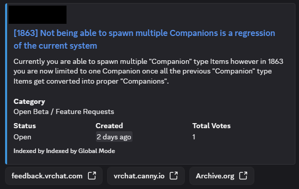
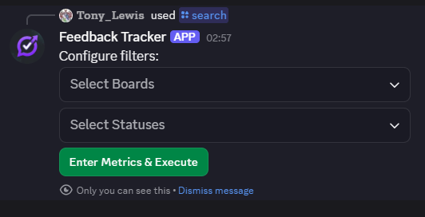
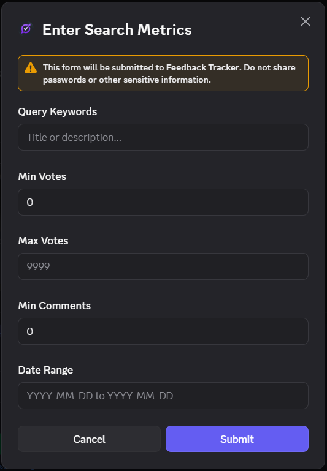
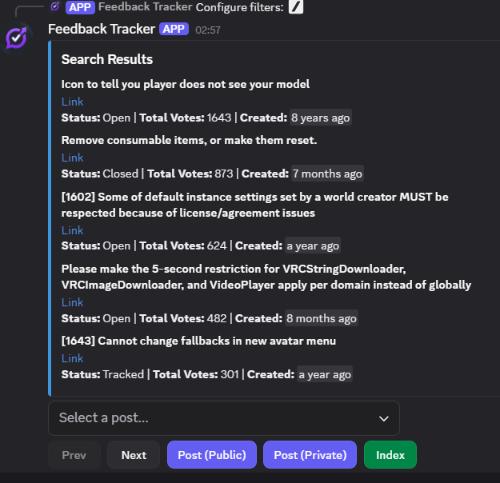
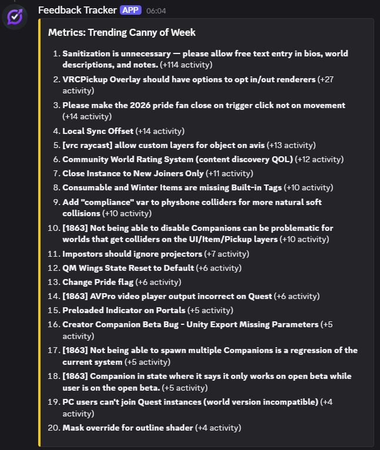

# VRChat Canny Status Tracker

A powerful, distributed Discord bot designed to keep your community informed about feedback and feature requests from `feedback.vrchat.com`.

## Features
- **Real-time Status Tracking**: Automatically receive updates when a Canny post's status changes or hits vote milestones.

- **Global & Local Modes**: Choose whether to receive updates for all tracked posts globally or keep things focused on your server's interests.
- **Deep Search**: Utilize an interactive search system with advanced filters (boards, status, votes, etc.) to find exactly what you're looking for.

- **Adaptive Polling**: Intelligent polling logic ensures active posts are updated frequently while conserving resources for older content.
- **User App Integration**: Convenient context menu commands allow users to interact with Canny links directly from any message.
- **Metrics & Insights**: Track trending feedback and recognize top contributors with detailed weekly and monthly analytics.

- **Multi-lingual Support**: Fully localizable UI with support for 12+ languages.

## Commands
- `/stats`: View global and server-specific activity metrics.
- `/metrics`: View top contributors and trending posts.
- `/search`: Search Canny posts with interactive filters.
- `/ping`: Check API and bot latencies.
- `/credit`: Bot information and affiliation details.
- `/help`: Detailed command guide and usage tips.

### Administrative Commands
*These commands require the **Manage Messages** permission.*

- `/settings`: View current server configuration.
- `/mode`: Toggle between **Global** and **Local** tracking.
- `/set_status_channel`: Select where updates are posted (Supports Text and Thread channels).
- `/react_channel`: Manage auto-indexing channels (Supports Text, Thread, and Forum channels).
- `/set_language`: Change the UI language.
- `/bulk_add`: Index Canny links from channel history.

## Context Menus (User Apps)
- `Index this canny`: Track a post from any message link.
- `Check canny status`: Instant status/vote overview.
- `Post what I indexed in hour`: Summary of your recent activity.
- `Check Trending Canny`: View weekly/monthly trending feedback.
- `Check Canny Author Metrics`: View top feedback authors.

## Affiliation & Legal
**This bot is an independent project and is not affiliated with VRChat Inc.**

All data is sourced from the public VRChat Canny feedback portal. Use of this bot is subject to the [Terms of Service](Terms/tos.md) and [Privacy Policy](Terms/privacy.md).

## Credits
Hosted by [VRCβフォース](https://discord.gg/XJHRXwd).
Open Source under the MIT License.
